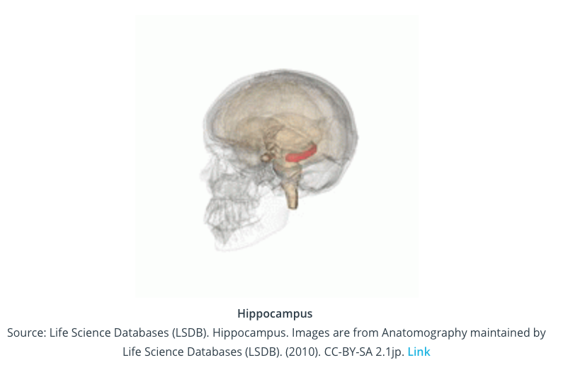
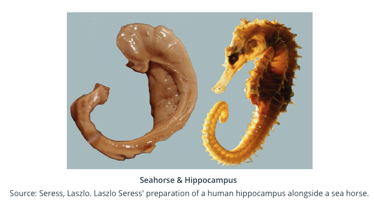
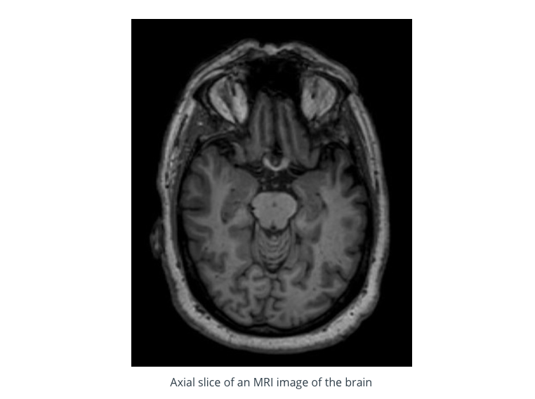
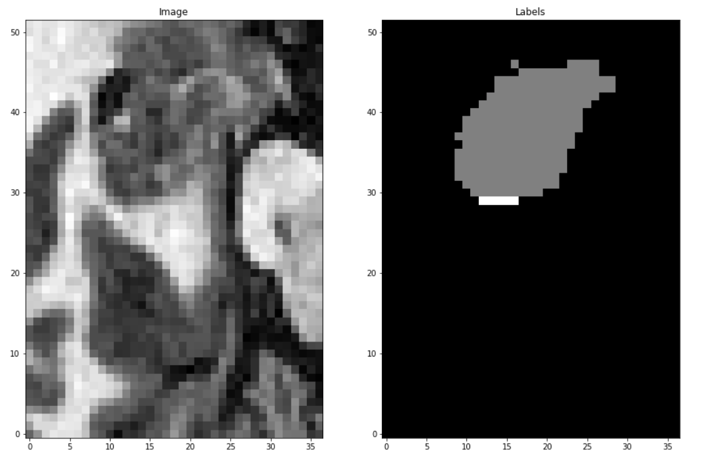
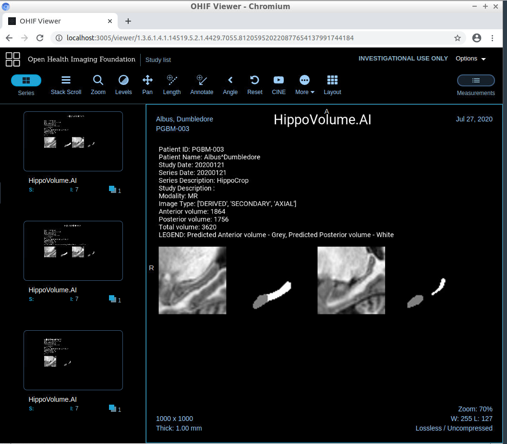

# Predicting Alzheimer's disease using 3D MRI medical images

## Introduction 
In this project I develop a deep learning model to predict Alzheimer's disease using 3D MRI medical images. Alzheimer's disease (AD) is a progressive neurodegenerative disorder that results in impaired neuronal (brain cell) function and eventually, cell death. For patients exhibiting early symptoms, quantifying disease progression over time can help direct therapy and disease management. 

#### Location of the Hippocampus within the brain

A radiological study via MRI exam is currently one of the most advanced methods to quantify the disease. In particular, the measurement of hippocampal volume has proven useful to diagnose and track progression in several brain disorders, most notably in AD. Studies have shown a reduced volume of the hippocampus in patients with AD.

#### Size and shape of the Hippocampus

In this project I will build an end-to-end deep learning/AI system which features a machine learning algorithm that integrates into a clinical-grade viewer and automatically measures hippocampal volumes of new patients from their MRI images, as their studies are committed to the clinical imaging archive.

#### Axial slice of an MRI image of the brain

I will use the dataset that contains the segmentations of the right hippocampus and will use the U-Net deep learning architecture to build a segmentation model.

#### Cropped Hippocampus area from MRI image & predicted Hippocampus anterior (front) volume 

After the model is built, I will proceed to integrate the model into a working clinical PACS such that it runs on every incoming study and produces a report with volume measurements.

## The Dataset

I will be using the "Hippocampus" dataset from the [Medical Decathlon competition](http://medicaldecathlon.com). This dataset is stored as a collection of NIFTI files, with one file per volume, and one file per corresponding segmentation mask. The original images here are T2 MRI scans of the full brain. 

## Key files

### June 2020

- [Exploratory Data Analysis of Hippocampus 3D brain MRI images](https://github.com/pranath/predict_alzheimers/blob/master/eda.ipynb)
- [Building & Training Model for Hippocampus volume prediction](https://github.com/pranath/predict_alzheimers/blob/master/model/experiments/UNetExperiment.py)
- [Using model for inference](https://github.com/pranath/predict_alzheimers/blob/master/deployment/inference/UNetInferenceAgent.py)

## Results

The final model achieved a mean dice score of 1.47 and a mean jaccard score of 0.81 in terms of accuracy for correctly classifying the anterior and posterior volumes of the Hippocampus. The model was then integrated into a clinical viewer to generate automated reports and predictions for Hippocampus volumes for submitted brain MRI scans.

#### Showing model deployment in automated report with predictions integrated into medical viewer

